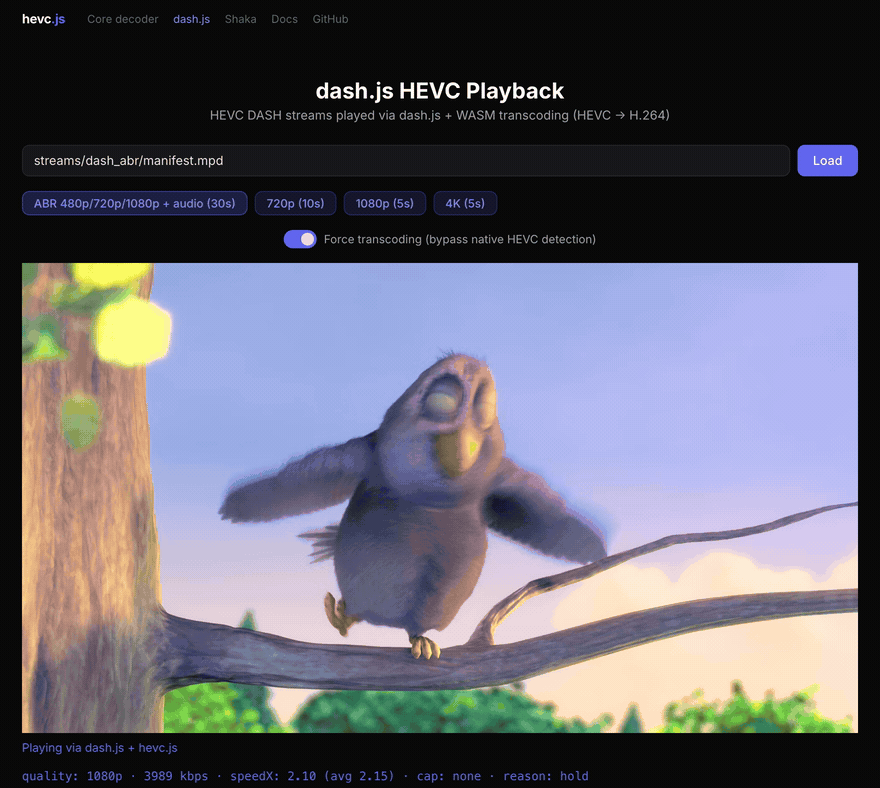

# hevc.js

[](https://github.com/privaloops/hevc.js/actions/workflows/build.yml)
[](https://github.com/privaloops/hevc.js/actions/workflows/test.yml)
[](LICENSE)
[](https://www.npmjs.com/package/@hevcjs/core)
[](https://www.npmjs.com/package/@hevcjs/dashjs-plugin)
[](https://www.npmjs.com/package/@hevcjs/shaka-plugin)
[](https://www.npmjs.com/package/@hevcjs/hlsjs-plugin)

##### English | [简体中文](./README.zh_CN.md)

**Play HEVC/H.265 video in browsers without native support. No plugin. No install. No server changes.**



A from-scratch HEVC decoder written in C++17, compiled to WebAssembly, with drop-in plugins for dash.js and Shaka Player. Transcodes HEVC to H.264 in real-time, client-side, via WebCodecs inside a Web Worker. Works on Chrome, Edge, and Firefox where WebCodecs H.264 encoding is available.

1080p @ 60fps. 236KB WASM. Zero dependencies. No special server headers required. Compute-aware quality control caps the player's ABR ceiling when the device can't transcode at real-time, so the buffer never starves — on by default, no manual tuning.

Built in 8 days by one developer, assisted by AI — [read the story](https://www.developpement.ai/blog/hevcjs-decodeur-h265-navigateur-wasm).

## Adoption

- **dash.js** — hevc.js ships as an official [HEVC playback sample](https://github.com/Dash-Industry-Forum/dash.js/pull/5028) in dash.js (5.2.1+).
- **Shaka Player** — the [Shaka plugin](https://www.npmjs.com/package/@hevcjs/shaka-plugin) was built after a Shaka Player maintainer [requested it](https://github.com/privaloops/hevc.js/issues/101).

See [ROADMAP.md](ROADMAP.md) for what's next.

---

## JavaScript plugin

### Try it in 30 seconds (CDN, zero build)

No bundler, no file copying — load everything from public CDNs:

```html
<video id="player" controls></video>

<script src="https://cdn.dashjs.org/latest/dash.all.min.js"></script>
<script type="module">
  import { attachHevcSupport } from 'https://esm.sh/@hevcjs/dashjs-plugin@1';

  const player = dashjs.MediaPlayer().create();
  await attachHevcSupport(player, {
    wasmUrl:       'https://unpkg.com/@hevcjs/core@1/dist/wasm/hevc-decode.js',
    wasmBinaryUrl: 'https://unpkg.com/@hevcjs/core@1/dist/wasm/hevc-decode.wasm',
    workerUrl:     'https://unpkg.com/@hevcjs/core@1/dist/transcode-worker.js',
  });
  player.initialize(document.querySelector('#player'), 'https://example.com/manifest.mpd', true);
</script>
```

Cross-origin Worker and WASM loading are handled automatically. For production, prefer the npm install below (self-hosted assets, version pinning).

### Installation

```bash
npm install @hevcjs/dashjs-plugin   # dash.js
npm install @hevcjs/shaka-plugin    # Shaka Player
npm install @hevcjs/hlsjs-plugin    # hls.js
```

### Setup

The plugin relies on 3 static files from `@hevcjs/core` (installed as a transitive dependency) that must be served by your web server:

- `transcode-worker.js` — Web Worker (IIFE, standalone)
- `wasm/hevc-decode.js` — Emscripten glue code
- `wasm/hevc-decode.wasm` — WASM binary (236KB)

Copy them from `node_modules/@hevcjs/core/dist/` to your public directory:

```bash
cp node_modules/@hevcjs/core/dist/transcode-worker.js public/
cp node_modules/@hevcjs/core/dist/wasm/hevc-decode.js public/
cp node_modules/@hevcjs/core/dist/wasm/hevc-decode.wasm public/
```

Pass the path to the copied worker via `workerUrl` in the example below. The worker loads `hevc-decode.js` / `.wasm` from the same directory automatically.

### dash.js

```js
import dashjs from 'dashjs';
import { attachHevcSupport } from '@hevcjs/dashjs-plugin';

const player = dashjs.MediaPlayer().create();
attachHevcSupport(player, { workerUrl: './transcode-worker.js' });
player.initialize(videoElement, 'https://example.com/manifest.mpd', true);
```

### Shaka Player

```js
import shaka from 'shaka-player';
import { registerHevcTransmuxer } from '@hevcjs/shaka-plugin';

const handle = registerHevcTransmuxer(shaka, { workerUrl: './transcode-worker.js' });

const player = new shaka.Player();
await player.attach(videoElement);
handle.attachComputeAware(player);          // wire compute-aware ABR (on by default)
await player.load('https://example.com/manifest.mpd');
```

`registerHevcTransmuxer` registers a Shaka `Transmuxer` for `hev1`/`hvc1`, so Shaka handles MIME routing natively. To force transcoding even where HEVC is supported natively, use Shaka's built-in `player.configure({ mediaSource: { forceTransmux: true } })`.

`handle.attachComputeAware(player)` is what enables compute-aware quality control (see below). It's a separate call because Shaka's player instance doesn't exist at register time. Pass `adaptiveCompute: false` in the register config to opt out.

### hls.js

```js
import Hls from 'hls.js';
import { attachHevcSupport } from '@hevcjs/hlsjs-plugin';

// Before `new Hls()` — hls.js filters levels against
// MediaSource.isTypeSupported at manifest parse time.
await attachHevcSupport({ workerUrl: './transcode-worker.js' });

const hls = new Hls({ preferManagedMediaSource: false });
hls.attachMedia(videoElement);
hls.loadSource('https://example.com/playlist.m3u8');
```

No player instance needed: hls.js keeps HEVC levels in its ladder as long as the (patched) `MediaSource.isTypeSupported` accepts them. Supported today: fMP4 HLS with video-only or demuxed-audio renditions; muxed A/V segments play video-only for now. See the [plugin README](packages/hlsjs-plugin/README.md) for details.

### How the transcoding works

1. **MSE intercept** — Patches `MediaSource.addSourceBuffer()` before the player initializes. When the player creates an HEVC SourceBuffer, we return a proxy that accepts HEVC data but feeds H.264 to the real SourceBuffer.

2. **Worker pipeline** — All heavy work runs in a Web Worker:
   - **Demux**: mp4box.js extracts raw HEVC NAL units from fMP4 segments
   - **Decode**: WASM decoder produces YUV frames (spec-compliant, pixel-perfect)
   - **Encode**: WebCodecs `VideoEncoder` compresses to H.264
   - **Mux**: Custom fMP4 muxer wraps H.264 in ISO BMFF with correct timestamps

3. **Transparent to the player** — The proxy reports `updating`, fires `updatestart`/`updateend` events, and returns real `buffered` ranges. The player's buffer management, ABR logic, and seek handling work unmodified.

**Tradeoff**: the software fallback introduces 2-3s of startup latency on the first segment (vs instant playback with native hardware decode). Once buffered, playback is smooth. When native HEVC is available, hevc.js detects it and does nothing.

### Compute-aware quality control

WASM-based HEVC transcoding is significantly more expensive than native decode. On low-end CPUs at 1080p, transcoding a 2s segment can take 6s — the buffer drains at -4s per segment and playback freezes. Bandwidth-based ABR (Shaka, dash.js) doesn't see this: the network is fine, so it keeps the top variant.

The plugins fix this by piping per-segment transcode `speedX` (`segDurMs / wallClockMs`) onto a small in-process bus that both plugins consume. A player-agnostic decider observes the rolling speed, applies hysteresis, and asks the host player to narrow its variant ceiling via the player's own public ABR settings:

- **Shaka** → `player.configure({ abr: { restrictions: { maxHeight, maxBandwidth } } })`
- **dash.js** → `player.updateSettings({ streaming: { abr: { maxBitrate: { video } } } })`

The host ABR is never replaced — we only narrow the menu it picks from. Once headroom returns (sustained `speedX > 1.3×`), the ceiling lifts back up.

**On by default.** Pass `adaptiveCompute: false` to opt out:

```js
// Tune (defaults: measureWindow 2, lowerAfter 1, raiseAfter 6, targetSpeedX 1.3)
registerHevcTransmuxer(shaka, { adaptiveCompute: { targetSpeedX: 1.5 } });
// or
attachHevcSupport(player, { adaptiveCompute: false });
```

Telemetry hook for diagnostics — fires on every segment, not just cap changes:

```js
attachHevcSupport(player, {
  adaptiveCompute: {
    onObservation: (stat, avg, capIdx, reason) => {
      console.log(`speedX=${stat.speedX} avg=${avg} cap=${capIdx} (${reason})`);
    },
  },
});
```

`subscribeSegmentStat` is also exported from both plugins if you want the raw perf bus.

### Browser compatibility

hevc.js transcodes HEVC to H.264 client-side. This requires two things from the browser: **WebAssembly** (to run the HEVC decoder) and **WebCodecs VideoEncoder with H.264 support** (to re-encode the decoded frames). When native HEVC is available, the plugin detects it and does nothing — zero overhead.

**Detection strategy**: `MediaSource.isTypeSupported()` can lie (Firefox on Windows reports HEVC support even without the HEVC Video Extension installed). hevc.js verifies native support by actually creating a SourceBuffer — if that fails, it falls back to transcoding. On iPhone Safari (iOS 17.1+), only `ManagedMediaSource` exists — hevc.js detects native HEVC through it and defers to the browser (the transcoding path requires classic `MediaSource`). For the same reason, `forceTranscode` is ignored there for the dash.js plugin and playback stays native; Shaka's `forceTransmux` still works since Shaka feeds its own SourceBuffers.

Each browser has its own decode path on Windows, with different dependencies:

- **Chrome 107+ (Windows)** uses `D3D11VideoDecoder` → D3D11VA (DXVA) directly. **No Microsoft extension required.** Requires a GPU with HEVC hardware decoder (Intel Skylake 2015+, NVIDIA Maxwell 2nd gen / GTX 960 2015+, AMD Fiji / R9 Fury 2015+). No software fallback — if the GPU cannot decode HEVC, Chrome will not play it. Chrome < 130 also caps at 1920×1088 @ 30fps.
- **Edge (Windows)** uses `VDAVideoDecoder` → MFT (Media Foundation). **Requires the Microsoft [HEVC Video Extension](https://apps.microsoft.com/detail/9nmzlz57r3t7)** (~$1 on the Store). Without it, no HEVC regardless of GPU.
- **Firefox 133+ (Windows)** also uses MFT and has the same dependency on the Microsoft HEVC Video Extension.
- **Firefox 137+ (Linux)** decodes HEVC natively — hardware via VA-API, software via the system ffmpeg. Availability follows the distro's ffmpeg build; the SourceBuffer probe falls back to transcoding when it doesn't.
- **macOS (Safari / Chrome / Edge / Firefox)** decode HEVC natively via VideoToolbox. No extension.

| Browser + OS + condition | Native HEVC | hevc.js activates? | Transcoding works? | Why |
|---|---|---|---|---|
| **Safari 13+** (macOS/iOS) | Yes (VideoToolbox) | No — native | — | Hardware decode via macOS/iOS (iPhone: detected via `ManagedMediaSource`, iOS 17.1+) |
| **Chrome/Edge/Firefox** (Mac) | Yes (VideoToolbox) | No — native | — | Native decode via macOS |
| **Chrome 107+** (Win, HEVC-capable GPU) | Yes (D3D11VA) | No — native | — | Direct GPU decode, no extension needed |
| **Chrome 107+** (Win, GPU without HEVC) | No | **Yes** | **Yes** | Chrome has no software HEVC fallback |
| **Edge** (Win, with HEVC Video Extension) | Yes (MFT) | No — native | — | Requires Microsoft [HEVC Video Extension](https://apps.microsoft.com/detail/9nmzlz57r3t7) |
| **Edge** (Win, no extension) | No | **Yes** | **Yes** | MFT without extension: no decoder |
| **Firefox 133+** (Win, with HEVC Video Extension) | Yes (MFT) | No — native | — | Requires Microsoft extension |
| **Firefox 133+** (Win, no extension) | Reported but fake | **Yes** | **Yes** | SourceBuffer probe catches the false positive, falls back to transcoding |
| **Chrome/Edge 94–106** | No | **Yes** | **Yes** | HEVC not yet shipped in browser, WebCodecs H.264 encoder available |
| **Chrome/Edge < 94** | No | No | No | No WebCodecs — serve AVC content directly |
| **Chrome** (Linux, VAAPI enabled) | Variable | Sometimes | **Yes** | Depends on driver and GPU |
| **Chrome** (Linux, no VAAPI) | No | **Yes** | **Yes** | Software H.264 encode via WebCodecs |
| **Firefox 137+** (Linux, ffmpeg with HEVC) | Yes (VA-API / ffmpeg) | No — native | — | Native since Firefox 137 — hardware VA-API or system ffmpeg |
| **Firefox < 137** (Linux) | No | **Yes** | Depends | Requires a working H.264 encoder via WebCodecs — fails on headless/VM setups |

**Requirements** (supported by all modern browsers):
- **WebAssembly** + **Web Workers**
- **Secure Context** (HTTPS or localhost) — WebCodecs is not available on plain HTTP
- **WebCodecs VideoEncoder** with H.264 support — this is the main limiting factor

No `Cross-Origin-Embedder-Policy` or `Cross-Origin-Opener-Policy` headers needed — the WASM decoder is single-threaded and doesn't use `SharedArrayBuffer`. Works on any static file server.

---

## C/C++ decoder

### Why a from-scratch decoder?

[libde265](https://github.com/strukturag/libde265) exists, is mature, and works. So why write another HEVC decoder?

This implementation targets a different niche on three axes:

- **Size** — 236 KB WASM vs ~2 MB for libde265 compiled to WASM. 8× smaller — which matters when shipping to a browser, a microVM, or a sandboxed runtime.
- **Modernity & license** — C++17 throughout (`std::optional`, `std::shared_ptr`, `std::array`, `constexpr`), single-threaded, zero dependencies, **MIT-licensed** (vs LGPL for libde265 — relevant for static linking in commercial products).
- **Spec traceability** — function names mirror ITU-T H.265 section numbers, and [`docs/cross-reference.md`](docs/cross-reference.md) maps every spec section to its source file and test. Useful if you want to *understand* HEVC, not just decode it (universities, codec research, contributors).

This is **not a libde265 replacement** — libde265 is faster on pure native and battle-tested in production (GStreamer, VLC, libheif, FFmpeg fallback). For embedding in browsers, microVMs, and sandboxed environments where binary size, license, or readability matter more than the last 20% of native throughput, this decoder is a viable alternative.

### C API

```c
#include "wasm/hevc_api.h"

HEVCDecoder* dec = hevc_decoder_create();
hevc_decoder_decode(dec, data, size);

int count = hevc_decoder_get_frame_count(dec);
for (int i = 0; i < count; i++) {
    HEVCFrame frame;
    hevc_decoder_get_frame(dec, i, &frame);
    // frame.y / frame.cb / frame.cr — YUV planes (uint16_t*)
    // frame.width / frame.height — luma dimensions
    // frame.bit_depth — 8 or 10
}

hevc_decoder_destroy(dec);
```

### API reference

```c
// Lifecycle
HEVCDecoder* hevc_decoder_create(void);
void          hevc_decoder_destroy(HEVCDecoder* dec);

// Decode a complete HEVC bitstream (Annex B format)
int hevc_decoder_decode(HEVCDecoder* dec, const uint8_t* data, size_t size);

// Incremental decode (feed NAL units progressively)
int hevc_decoder_feed(HEVCDecoder* dec, const uint8_t* data, size_t size);
int hevc_decoder_drain(HEVCDecoder* dec);

// Access decoded frames (display order)
int hevc_decoder_get_frame_count(HEVCDecoder* dec);
int hevc_decoder_get_frame(HEVCDecoder* dec, int index, HEVCFrame* frame);
```

| HEVCFrame field | Type | Description |
|---|---|---|
| `y`, `cb`, `cr` | `const uint16_t*` | YUV plane pointers |
| `width`, `height` | `int` | Luma dimensions (conformance window applied) |
| `stride_y`, `stride_c` | `int` | Plane strides in samples |
| `bit_depth` | `int` | 8 or 10 |
| `poc` | `int` | Picture Order Count (display order) |

### Build

#### Native (debug + tests)

```bash
cmake -B build -DCMAKE_BUILD_TYPE=Debug
cmake --build build
cd build && ctest --output-on-failure    # 128 tests
```

#### WebAssembly

Requires [Emscripten SDK](https://emscripten.org/docs/getting_started/downloads.html).

```bash
source ~/emsdk/emsdk_env.sh
emcmake cmake -B build-wasm -DBUILD_WASM=ON -DCMAKE_BUILD_TYPE=Release
cmake --build build-wasm
# Output: build-wasm/hevc-decode.js + hevc-decode.wasm (236KB)
```

### Performance

Single-threaded, Apple Silicon (M-series):

| | Native C++ | WASM (Chrome) | vs libde265 (WASM) |
|---|---|---|---|
| **1080p decode** | 76 fps | 61 fps | **83%** of libde265 speed |
| **4K decode** | 28 fps | 21 fps | — |
| **1080p transcode** | — | ~2.5x realtime (6s segment in 2.4s) | — |

The WASM decoder is within 20% of native C++ performance, and reaches **83% the speed of libde265** (a mature, 10-year-old optimized HEVC decoder) when both are compiled to WASM — in **1/8th the binary size** (236 KB vs ~2 MB).

### Spec conformance

Implemented per **ITU-T H.265 (v8, 08/2021)** — 716 pages, transcribed directly from the spec. Validated pixel-perfect against ffmpeg on 128 test bitstreams. Each spec section is mapped 1:1 to its source file and test in [`docs/cross-reference.md`](docs/cross-reference.md).

| Feature | Status |
|---|---|
| CABAC arithmetic decoding (§9.3) | Complete |
| 35 intra prediction modes (§8.4) | Complete |
| Inter prediction — merge, AMVP, TMVP (§8.5) | Complete |
| 8-tap luma / 4-tap chroma interpolation (§8.5.3) | Complete |
| Weighted prediction — default + explicit (§8.5.3.3) | Complete |
| Inverse transform — DCT 4-32, DST 4 (§8.6) | Complete |
| Scaling lists (§8.6.3) | Complete |
| Deblocking filter (§8.7.2) | Complete |
| SAO — edge + band offset (§8.7.3) | Complete |
| 10-bit decoding (Main 10 profile) | Complete |
| Multi-slice (dependent + independent) | Complete |
| Tiles | Parsed + sequential decode |
| WPP (Wavefront Parallel Processing) | Complete |

---

## Architecture

```
hevc.js/
├── src/                    C++17 HEVC decoder (ITU-T H.265 spec-compliant)
│   ├── bitstream/          Annex B parsing, NAL units, RBSP, Exp-Golomb
│   ├── syntax/             VPS, SPS, PPS, slice header parsing
│   ├── decoding/           CABAC, coding tree, intra/inter prediction, transform
│   ├── filters/            Deblocking filter, SAO
│   ├── common/             Types, Picture buffer, thread pool
│   └── wasm/               C API, Emscripten bindings
│
├── packages/
│   ├── core/               @hevcjs/core — WASM decoder + transcoding pipeline
│   ├── dashjs-plugin/      @hevcjs/dashjs-plugin — dash.js plugin
│   ├── shaka-plugin/       @hevcjs/shaka-plugin — Shaka Player plugin
│   └── hlsjs-plugin/       @hevcjs/hlsjs-plugin — hls.js plugin
│
├── demo/                   Browser demos (DASH + HLS)
└── tests/                  Unit tests + 128 oracle tests (pixel-perfect vs ffmpeg)
```

## Demos

**[Live demos](https://hevcjs.dev/demo/)** — try each plugin in your browser:

| Demo | Description |
|---|---|
| [Decoder](https://hevcjs.dev/demo/) | Raw WASM decoder — drop a .265 file, frame-by-frame playback |
| [dash.js](https://hevcjs.dev/demo/dash.html) | HEVC DASH streams via dash.js + WASM transcoding |
| [Shaka](https://hevcjs.dev/demo/shaka.html) | HEVC DASH streams via Shaka Player + WASM transcoding |
| [hls.js](https://hevcjs.dev/demo/hls.html) | HEVC HLS streams (ABR + audio) via hls.js + WASM transcoding |

**Docs:** [dash.js plugin](https://hevcjs.dev/docs/dashjs-plugin.html) · [Shaka plugin](https://hevcjs.dev/docs/shaka-plugin.html) · [hls.js plugin](https://hevcjs.dev/docs/hlsjs-plugin.html)

Each demo includes a **"Force transcoding"** toggle to bypass native HEVC detection — useful for testing the WASM pipeline on browsers that already support HEVC.

### Run locally

```bash
pnpm install
pnpm build:demo     # Builds WASM + JS bundles + copies assets
npx serve demo      # Open http://localhost:3000
```

## Contributors

Thanks goes to these people ([emoji key](https://allcontributors.org/docs/en/emoji-key)):

<table>
  <tr>
    <td align="center">
      <a href="https://github.com/privaloops">
        <br />
        <sub><b>Thibaut Lion</b></sub>
      </a><br />
      💻 📖 🤔 👀 🚇 ⚠️ 🚧
    </td>
    <td align="center">
      <a href="https://github.com/kasty">
        <br />
        <sub><b>Marie</b></sub>
      </a><br />
      🤔 👀 ⚠️
    </td>
  </tr>
</table>

## License

MIT — see [LICENSE](LICENSE).

HEVC/H.265 may be covered by patents managed by Access Advance and other patent pools. This software is an independent implementation and does not include or grant any patent license. Users are responsible for evaluating patent obligations in their jurisdiction and use case.

Media samples use [Big Buck Bunny](https://peach.blender.org/) (CC-BY 3.0, Blender Foundation). See [THIRD-PARTY-NOTICES.md](THIRD-PARTY-NOTICES.md) for full attribution.
